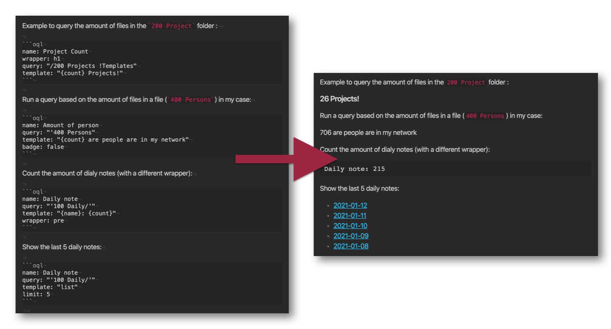

# Obsidian Query Language 

This is a plugin for Obsidian (https://obsidian.md) that allows you to query your notes and gather information about your vault inside a note itself. You write queries and configure them with a code-block and the renderer will output the results in the markdown preview:



## Installation

Clone this repository in the `.obsidian/plugins` folder and enable it in the settings of Obsidian. 

## Working with the plugin & examples

You can query your vault with a `oql` code block, for example:

````markdown
```oql
name: Daily notes
query: "'100 Daily/'"
template: "{name}: {count}"
```
````

This little block in a note renders to an template, counting the notes in the `100 Daily` folder and returns a output that renders as: `Daily notes: 100` in the case you have 100 daily notes. This is just a basic way of querying your vault. This is the full config will al fields that is available:

````markdown
```oql
name: Daily notes               # The name of query (can be used in the template as {name})
query: "'100 Daily/'"           # The actual query to use with Fuse.js
template: "{name}: {count}"     # or use "table" or "list" for a different output
badge: true                     # Show the OQL badge on the right 
debug: true                     # Show the debug window
wrapper: "div"                  # Wrapper (in the case you want to render a title like `h1`)
limit: 10                       # When using list or table view, limit the result to N.
sort: "title"                   # or "-title" for descending sort, you can also sort on 'modified' or 'created'
fields: ['title', 'created']    # Fields to show in table view
```
````

### More examples:

*Please note that the query syntax is different in Fuse* (that this plugin uses) than the current query model or search in Obsidian. Until Obsidian opens up the API for the search it's this way for now. You can use the `debug: true` in the code-block to see the results return by the query.

Render a query to a string:

````markdown
```oql
name: "Daily notes"
query: "'100 Daily/'"
template: "{name}: {count}"
```
````

Show debug window that lists the results, and wrap the results in a heading:

````markdown
```oql
name: "Daily notes"
query: "'100 Daily/'"
template: "{name}: {count}"
debug: true
wrapper: h1
```
````

Render a list of 10 notes in `folder1/`.

````markdown
```oql
name: Persons
query: "'folder1/'"
template: "list" # Renders to a list with notes linked
limit: 10
```
````

Show the oldest 5 projects (sort -created) with their modified at date in table:

````markdown
```oql
name: Oldest projects
query: "'200 Projects/"
template: "table"
sort: '-created'
limit: 5
badge: false
fields: ['title', 'modified']
```
````

Count the amount notes that contain a certain tag:

````
```oql
name: 'How many notes use #utrecht'
query: "'#utrecht"
template: "{name}: {count}"
badge: false
```
````

Check out the [extended search docs from Fuse](https://fusejs.io/examples.html#extended-search) to figure out how to query your own vault. **The syntax doesn't match the current query syntax of Obsidian search. Please be aware!**

## How does this plugin work?

It builds a parallel index using [Fuse](https://fusejs.io/) that you can query for data! 

## Todo / Features

- [x] Sorting the ouput?
- [ ] Other output options like a table or something? Or even a graph?
- [ ] Created/Modified timestamps are available, can we query those as well?
- [ ] Multiple queries? (Idea by [Liam](https://github.com/liamcain/))
- [ ] Configure Fuse settings in a settings tab of the plugin?
- [ ] Convert to search API of obsidian once it's available.